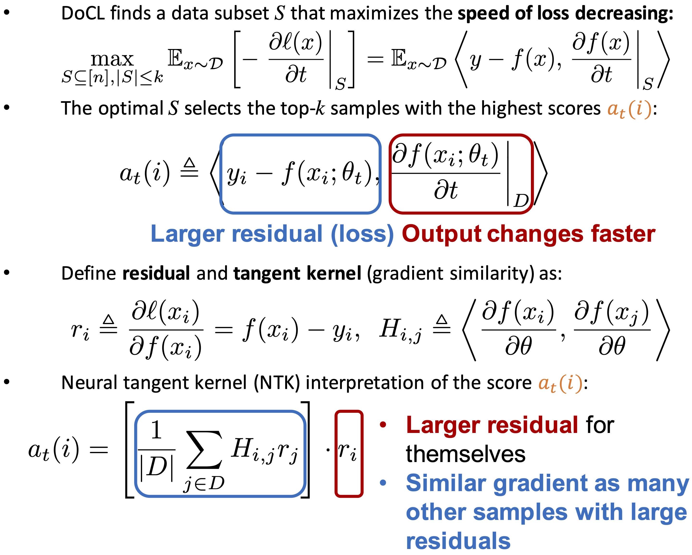

# Curriculum Learning by Optimizing Learning Dynamics (DoCL)

## AISTATS 2021 paper:

<b>Title</b>: <i>Curriculum Learning by Optimizing Learning Dynamics</i> <a href="http://proceedings.mlr.press/v130/zhou21a/zhou21a.pdf">[pdf]</a> <a href="http://proceedings.mlr.press/v130/zhou21a/zhou21a-supp.pdf">[appendix]</a> <a href="https://virtual.aistats.org/media/Slides/aistats/2021/virtual(14-19-45)-14-19-45UTC-1556-curriculum_lear.pdf">[slides]</a>\
<b>Authors</b>: Tianyi Zhou, Shengjie Wang, Jeff A. Bilmes\
<b>Institute</b>: University of Washington, Seattle

<pre>
@inproceedings{
    zhou2020docl,
    title={Curriculum Learning by Optimizing Learning Dynamics},
    author={Tianyi Zhou and Shengjie Wang and Jeff A. Bilmes},
    booktitle={Proceedings of The 24th International Conference on Artificial Intelligence and Statistics (AISTATS)},
    year={2021},
}</pre>

<b>Abstract</b>\
We study a novel curriculum learning scheme where in each round, samples are selected to achieve the greatest progress and fastest learning speed towards the ground-truth on all available samples. Inspired by an analysis of optimization dynamics under gradient flow for both regression and classification, the problem reduces to selecting training samples by a score computed from samples’ residual and linear temporal dynamics. It encourages the model to focus on the samples at learning frontier, i.e., those with large loss but fast learning speed. The scores in discrete time can be estimated via already-available byproducts of training, and thus require a negligible amount of extra computation. We discuss the properties and potential advantages of the proposed dynamics optimization via current deep learning theory and empirical study. By integrating it with cyclical training of neural networks, we introduce "dynamics-optimized curriculum learning (DoCL)", which selects the training set for each step by weighted sampling based on the scores. On nine different datasets, DoCL significantly outperforms random mini-batch SGD and recent curriculum learning methods both in terms of efficiency and final performance.

## Usage 

### Prerequisites
- [Python 3.7.4](https://www.python.org/)
- [PyTorch 1.1.0](https://pytorch.org/)
- [Numpy 1.17.2](http://www.numpy.org/)
- [Scikit-Learn 0.22.1](https://scikit-learn.org/)
- [Progress 1.5](https://github.com/verigak/progress/)
- [Pillow 6.2.2](https://pillow.readthedocs.io/en/stable/)

### Instructions
- For now, we keep all the DoCL code in `docl.py`. It supports multiple datasets and models. You can add your own options.
- Example scripts to run DoCL on CIFAR10/100 for training WideResNet-28-10 can be found in `docl_cifar.sh`.
- We apply multiple episodes of training epochs, each following a cosine annealing learning rate decreasing from `--lr_max` to `--lr_min`. The episodes can be set by epoch numbers, for example, `--epochs 300 --schedule 0 5 10 15 20 30 40 60 90 140 210 300`.
- DoCL reduces the selected subset's size over the training episodes, starting from n (the total number of training samples). Set how to reduce the size by `--k 1.0 --dk 0.1 --mk 0.3` for example, which starts from a subset size (k * n) and multiplies it by (1 - dk) until reaching (mk * n).
- To further reduce the subset in earlier epochs less than n and save more computation, add `--use_centrality` to further prune the DoCL-selected subset to a few diverse and representative samples according to samples' centrality (defined on pairwise similarity between samples). Set the corresponding selection ratio and how you want to change the ratio every episode, for example, `--select_ratio 0.5 --select_ratio_rate 1.1` will further reduce the DoCL-selected subset to be its half size in the first non-warm-starting episode and then multiply this ratio by 1.1 for every future episode until selection_ratio = 1.
- Centrality is an alternative of the facility location function in the paper in order to encourage diversity. The latter requires an external submodular maximization library and extra computation, compared to the centrality used here. We may add the option of submodular maximization in the future, but the centrality performs good enough on most tested tasks.
- Self-supervised learning may help in some scenarios. Two types of self-supervision regularizations are supported, i.e., `--consistency` and `--contrastive`.
- If one is interested to try DoCL on noisy-label learning (though not the focus of the paper), add `--use_noisylabel` and specify the noisy type and ratio using `--label_noise_type` and `--label_noise_rate`.

<b>License</b>\
This project is licensed under the terms of the MIT license.
